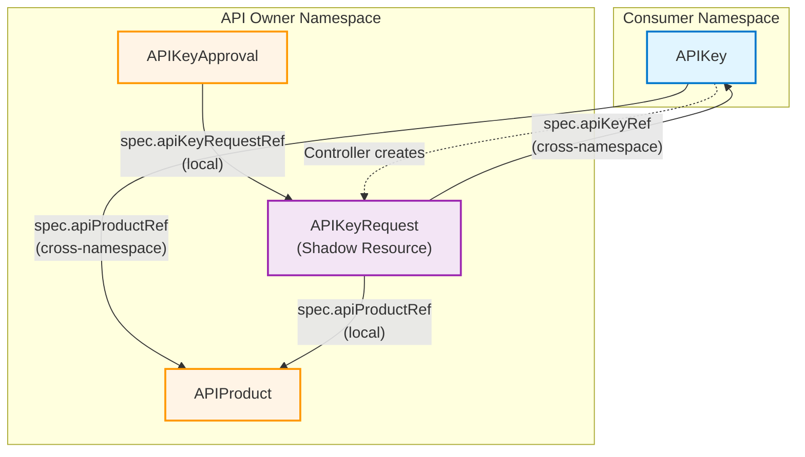

# Developer Portal Controller

Developer Portal APIs and Controllers for Kubernetes-based API management.

## Overview

The Developer Portal Controller provides Kubernetes Custom Resource Definitions (CRDs) for managing API products and API keys in a developer portal ecosystem. It integrates with Kuadrant and Gateway API to provide a complete API lifecycle management solution.

## Custom Resources

### APIProduct

The `APIProduct` resource represents an API offering in the developer portal. It references an HTTPRoute and can include documentation, contact information, and usage plans.

#### Example

```yaml
apiVersion: devportal.kuadrant.io/v1alpha1
kind: APIProduct
metadata:
  name: toystore-api
  namespace: default
spec:
  displayName: "Toystore API"
  description: "A comprehensive API for managing toy inventory, orders, and customer data"
  version: "v1"
  approvalMode: manual
  publishStatus: Published
  tags:
    - retail
    - inventory
    - e-commerce
  targetRef:
    group: gateway.networking.k8s.io
    kind: HTTPRoute
    name: toystore-route
  documentation:
    openAPISpecURL: "https://api.example.com/toystore/openapi.yaml"
    swaggerUI: "https://api.example.com/toystore/docs"
    docsURL: "https://docs.example.com/toystore"
    gitRepository: "https://github.com/example/toystore-api"
    techdocsRef: "url:https://github.com/example/toystore-api"
  contact:
    team: "Platform Team"
    email: "platform@example.com"
    slack: "#api-support"
    url: "https://example.com/support"
status:
  conditions:
  - lastTransitionTime: "2026-01-14T17:02:07Z"
    message: Discovered PlanPolicy toystore-plans targeting HTTPRoute toystore
    reason: Found
    status: "True"
    type: PlanPolicyDiscovered
  - lastTransitionTime: "2026-01-14T17:02:08Z"
    message: Discovered AuthPolicy toystore targeting HTTPRoute toystore
    reason: Found
    status: "True"
    type: AuthPolicyDiscovered
  - lastTransitionTime: "2026-01-14T17:02:07Z"
    message: HTTPRoute toystore/toystore accepted
    reason: HTTPRouteAccepted
    status: "True"
    type: Ready
  discoveredAuthScheme:
    authentication:
      api-key-users:
        apiKey:
          allNamespaces: true
          selector:
            matchLabels:
              app: toystore
        credentials:
          authorizationHeader:
            prefix: APIKEY
        metrics: false
        priority: 0
  discoveredPlans:
  - limits:
      daily: 100
    tier: gold
  - limits:
      daily: 50
    tier: silver
  - limits:
      daily: 10
    tier: bronze
  observedGeneration: 1
  openapi:
    lastSyncTime: "2026-01-14T17:02:07Z"
    raw: |
      ---
      openapi: "3.0.2"
      info:
        title: "Pet Store API"
        version: "1.0.0"
      servers:
        - url: https://toplevel.example.io/v1
      paths:
        /cat:
          get:
            operationId: "getCat"
            responses:
              405:
                description: "invalid input"
          post:
            operationId: "postCat"
            responses:
              405:
                description: "invalid input"
        /dog:
          get:
            operationId: "getDog"
            responses:
              405:
                description: "invalid input"
```

> [!NOTE]
> Breaking changes: The current `v1alpha1` API is in dev preview support mode, so breaking changes are acceptable.

#### APIProduct Spec Fields

- `displayName` (required): Human-readable name for the API product
- `description`: Detailed description of the API product
- `version`: API version (e.g., v1, v2)
- `approvalMode`: Whether access requests are auto-approved (`automatic`) or require manual review (`manual`)
- `publishStatus`: Controls visibility in the catalog (`Draft` or `Published`)
- `tags`: List of tags for categorization and search
- `targetRef`: Reference to the HTTPRoute that this API product represents
- `documentation`: API documentation links (OpenAPI spec, Swagger UI, docs URL, git repository, techdocs)
- `contact`: Contact information for API owners (team, email, Slack, URL)

#### APIProduct Status Fields

- `observedGeneration`: Generation of the most recently observed spec
- `discoveredPlans`: List of plan policies discovered from the HTTPRoute
- `openapi`: OpenAPI specification fetched from the API with sync timestamp
- `conditions`: Current state conditions (Ready, PlanPolicyDiscovered)

---

### APIKey

The `APIKey` resource represents a developer's request for API access. It includes information about the requester, the desired plan tier, and the use case.

#### Example

Before creating an APIKey, the consumer must create a Secret in their namespace containing the API key:

```yaml
apiVersion: v1
kind: Secret
metadata:
  name: toystore-apikey-secret
  namespace: consumer-namespace
type: Opaque
stringData:
  api_key: "your-api-key-value-here"
```

Then, create the APIKey resource:

```yaml
apiVersion: devportal.kuadrant.io/v1alpha1
kind: APIKey
metadata:
  name: toystore-apikey
  namespace: consumer-namespace
  labels:
    app.kubernetes.io/name: developer-portal-controller
    app.kubernetes.io/managed-by: kustomize
spec:
  apiProductRef:
    name: toystore-api
    namespace: api-owner-namespace
  secretRef:
    name: toystore-apikey-secret
  planTier: gold
  useCase: "Authentication key for our Toystore API integration"
  requestedBy:
    userId: user-12345
    email: developer@example.com
status:
  apiHostname: api.example.com

  # Rate limits from selected plan
  limits:
    daily: 1000
    monthly: 300000
    custom:
      - limit: 100
        window: 1m

  # Authentication scheme
  authScheme:
    credentials:
      authorizationHeader:
        prefix: "Bearer"
    authenticationSpec:
      selector:
        matchLabels:
          kuadrant.io/apikey: mobile-app-payment-key

  # Approval conditions
  # Lifecycle states:
  #   - Pending: No conditions (initial state after creation)
  #   - Approved: Approved condition with status "True"
  #   - Denied: Denied condition with status "True"
  #   - Failed: Failed condition with status "True"
  conditions:
    - type: Approved
      status: "True"
      reason: ApprovedByOwner
      message: APIKey has been approved for toystore integration
      lastTransitionTime: "2025-12-09T10:30:00Z"
```

> [!NOTE]
> Breaking changes: The current `v1alpha1` API is in dev preview support mode, so breaking changes are acceptable.

#### APIKey Spec Fields

- `apiProductRef` (required): Reference to the APIProduct this APIKey belongs to
  - `name`: Name of the APIProduct
  - `namespace`: Namespace of the APIProduct (enables cross-namespace references)
- `secretRef` (required): Reference to the secret containing the API key
  - `name`: Name of the secret in the consumer's namespace
  - Consumer creates this secret before creating the APIKey
  - The secret must contain an `api_key` entry with the value of the API key
  - Controller reads the API key from this secret on approval
- `planTier` (required): Tier of the plan (e.g., "gold", "silver", "bronze", "premium", "basic")
- `useCase` (required): Description of how the API key will be used
- `requestedBy` (required): Information about the requester
  - `userId`: Identifier of the user requesting the API key
  - `email`: Email address of the user (validated with regex pattern)

#### APIKey Status Fields

- `apiHostname`: Hostname from the HTTPRoute
- `limits`: Rate limits for the plan
- `authScheme`: Authentication scheme from the AuthPolicy
- `conditions`: Latest observations of the APIKey's state
  - Lifecycle states based on conditions:
    - **Pending**: No approval/denial conditions (initial state)
    - **Approved**: `Approved` condition with status `"True"`
    - **Denied**: `Denied` condition with status `"True"`
    - **Failed**: `Failed` condition with status `"True"`

---

### APIKeyRequest

The `APIKeyRequest` resource is a **shadow resource** automatically created by the Developer Portal Controller in the API owner's namespace whenever a consumer creates an `APIKey`. This design enables namespace-based RBAC: API owners can list and review access requests for their API products without requiring cluster-wide permissions to view all APIKeys across all consumer namespaces.

**Key characteristics:**

- Created automatically by the controller (not by users)
- Lives in the API owner's namespace
- Contains request metadata (use case, requester info, plan tier)
- Does NOT contain the API key secret value (preserves consumer data isolation)
- Serves as the basis for approval/denial decisions

#### Example

```yaml
apiVersion: devportal.kuadrant.io/v1alpha1
kind: APIKeyRequest
metadata:
  name: toystore-request-12345
  namespace: api-owner-namespace  # Owner's namespace
  labels:
    app.kubernetes.io/name: developer-portal-controller
    app.kubernetes.io/managed-by: kustomize
spec:
  # Reference to APIProduct in owner's namespace
  apiProductRef:
    name: toystore-api
  
  # Plan and use case details from consumer's request
  planTier: gold
  useCase: "Authentication key for our mobile app integration with Toystore API"
  
  # Information about who requested access
  requestedBy:
    userId: user-12345
    email: developer@example.com
  
  # Cross-namespace reference to the consumer's APIKey
  apiKeyRef:
    name: toystore-apikey
    namespace: consumer-namespace
status:
  conditions:
    - type: Pending
      status: "True"
      reason: AwaitingApproval
      message: Waiting for API owner to review the request
      lastTransitionTime: "2026-04-10T10:00:00Z"
```

> [!NOTE]
> Breaking changes: The current `v1alpha1` API is in dev preview support mode, so breaking changes are acceptable.

#### APIKeyRequest Spec Fields

- `apiProductRef` (required): Reference to the APIProduct in the owner's namespace
  - `name`: Name of the APIProduct
- `planTier` (required): Tier of the plan (e.g., "gold", "silver", "bronze")
- `useCase` (required): Description of how the API key will be used
- `requestedBy` (required): Information about the requester
  - `userId`: Identifier of the user requesting the API key
  - `email`: Email address of the user
- `apiKeyRef` (required): Cross-namespace reference to the consumer's APIKey
  - `name`: Name of the APIKey in the consumer's namespace
  - `namespace`: Namespace where the APIKey was created

#### APIKeyRequest Status Fields

- `conditions`: Latest observations of the APIKeyRequest's state
  - **Pending**: Request is awaiting review
  - **Approved**: Request has been approved
  - **Denied**: Request has been denied

---

### APIKeyApproval

The `APIKeyApproval` resource represents an API owner's decision to approve or deny an `APIKeyRequest`. API owners create this resource in their own namespace to review and make decisions on API access requests for their API products.

**Key characteristics:**

- Created by API owners (manual approval mode) or automatically (automatic mode)
- Lives in the API owner's namespace (same as the APIProduct)
- Contains approval decision and reviewer metadata
- Controller validates that the APIKeyApproval namespace matches the APIProduct namespace to prevent cross-namespace approval attacks

#### Example: Approval

```yaml
apiVersion: devportal.kuadrant.io/v1alpha1
kind: APIKeyApproval
metadata:
  name: toystore-approval-12345
  namespace: api-owner-namespace
  labels:
    app.kubernetes.io/name: developer-portal-controller
    app.kubernetes.io/managed-by: kustomize
spec:
  # Reference to the APIKeyRequest being reviewed
  apiKeyRequestRef:
    name: toystore-request-12345
  
  # Approval decision
  approved: true
  
  # Reviewer information
  reviewedBy: api-owner@example.com
  reviewedAt: "2026-04-10T12:00:00Z"
  
  # Optional context for the decision
  reason: "Approved"
  message: "The use case is valid and meets our API usage guidelines. Approved for production use with gold tier access."
```

#### Example: Denial

```yaml
apiVersion: devportal.kuadrant.io/v1alpha1
kind: APIKeyApproval
metadata:
  name: toystore-approval-67890
  namespace: api-owner-namespace
spec:
  apiKeyRequestRef:
    name: toystore-request-67890
  
  approved: false
  reviewedBy: api-owner@example.com
  reviewedAt: "2026-04-10T14:30:00Z"
  reason: "InvalidUseCase"
  message: "The requested use case does not align with our API terms of service. Please contact support at api-support@example.com for more information."
```

> [!NOTE]
> Breaking changes: The current `v1alpha1` API is in dev preview support mode, so breaking changes are acceptable.

#### APIKeyApproval Spec Fields

- `apiKeyRequestRef` (required): Reference to the APIKeyRequest being reviewed
  - `name`: Name of the APIKeyRequest (same namespace only)
- `approved` (required): Boolean indicating whether the request is approved (`true`) or denied (`false`)
- `reviewedBy` (required): Identifier of the person who reviewed the request (e.g., email, username)
- `reviewedAt` (required): Timestamp when the request was reviewed (RFC3339 format)
- `reason` (optional): Short reason for the decision (e.g., "Approved", "Denied", "InvalidUseCase")
- `message` (optional): Additional context or explanation for the approval or denial decision

---

## Entity Relationship Model

The following diagram illustrates the relationships between resources across namespace boundaries:



**Key Concepts:**

- **Namespace Isolation**: Consumer resources (APIKey) are isolated in the consumer's namespace; owner resources (APIProduct, APIKeyRequest, APIKeyApproval) are in the owner's namespace
- **Cross-Namespace References** (solid arrows): Enable consumers to request access to APIs owned by others
- **Local References** (solid arrows): Keep owner-side resources scoped within the owner's namespace
- **Controller Actions** (dashed arrows): Automated creation and updates by the Developer Portal Controller
- **Shadow Resource Pattern**: APIKeyRequest mirrors APIKey metadata in the owner's namespace without exposing sensitive data

---

## RBAC-Based Workflow

The Developer Portal Controller implements a namespace-based RBAC model with three personas:

### Workflow: Manual Approval Mode

1. **Consumer (API Consumer namespace)**
   - Creates an `APIKey` resource in their namespace
   - Specifies the desired API product, plan tier, and use case
   - APIKey starts in **Pending** state (no approval conditions)

2. **Controller (Automatic)**
   - Detects the new APIKey
   - Creates an `APIKeyRequest` shadow resource in the **API Owner's namespace**
   - Copies request metadata (use case, requester, plan tier) but NOT the API key value

3. **API Owner (API Owner namespace)**
   - Lists `APIKeyRequest` resources in their namespace
   - Reviews requests for their API products
   - Creates an `APIKeyApproval` resource with their decision
   - Controller validates that the approval namespace matches the APIProduct namespace

4. **Controller (Automatic)**
   - Processes the `APIKeyApproval` decision
   - Updates the consumer's `APIKey` conditions (Approved/Denied)
   - If approved: Creates the API key secret in the kuadrant namespace
   - Projects the API key value to `status.apiKeyValue` in the consumer's APIKey resource

5. **Consumer (API Consumer namespace)**
   - Checks their `APIKey` status for approval
   - Accesses the API key value from `status.apiKeyValue` (no secret read permissions needed)
   - Uses the API key to authenticate API requests

### Workflow: Automatic Approval Mode

If the APIProduct has `approvalMode: automatic`, the controller automatically creates an `APIKeyApproval` resource with `approved: true` when the `APIKeyRequest` is created, skipping the manual review step.

---

## Development Environment Setup

The `make local-setup` command sets up a complete local development environment using Kind (Kubernetes in Docker). This is useful for local development when you don't have Istio or Kuadrant controllers installed.

### What `make local-setup` Does

Running `make local-setup` performs the following steps:

1. **Creates a Kind cluster**
   - Deletes any existing `devportal-controller-local` Kind cluster
   - Creates a fresh Kind cluster with the name `devportal-controller-local`
   - Uses configuration from `utils/kind-cluster.yaml`

2. **Installs API dependencies (CRDs)**
   - Installs Developer Portal Controller CRDs (APIProduct, APIKey, APIKeyRequest, APIKeyApproval)
   - Installs Gateway API CRDs (HTTPRoute, Gateway, etc.)
   - Installs Kuadrant core CRDs (PlanPolicy, AuthPolicy)

3. **Installs demo resources**
   - Applies demo manifests from `utils/demo/gamestore.yaml`
   - Provides sample resources for testing and development

4. **Builds and deploys the controller**
   - Builds the controller Docker image from current code
   - Loads the image into the Kind cluster
   - Deploys the controller to the `developer-portal-controller-system` namespace
   - Waits for the deployment to become available

### Usage

```bash
# Set up the complete local development environment
make local-setup
```

### Individual Setup Steps

You can also run individual steps separately:

```bash
# Create only the Kind cluster with CRDs
make local-cluster-setup

# Add demo resources to an existing cluster
make demo-install

# Deploy controller from current code to an existing cluster
make local-deploy
```

## Usage

### Creating an APIProduct (API Owner)

1. Create an HTTPRoute for your API in your namespace
2. Create a PlanPolicy to define rate limits and tiers for the HTTPRoute
3. Create an APIProduct referencing the HTTPRoute
4. Set `approvalMode` to `manual` or `automatic` based on your approval requirements

### Requesting API Access (API Consumer)

1. **Create an APIKey** resource in your namespace referencing the API owner's APIProduct
   - Use a cross-namespace reference: `spec.apiProductRef.namespace`
   - Specify your desired plan tier and use case
   - Provide your user ID and email

2. **Wait for Review** (if `approvalMode` is `manual`)
   - Controller automatically creates an `APIKeyRequest` in the API owner's namespace
   - API owner reviews your request and creates an `APIKeyApproval` resource
   - Check your `APIKey` status conditions for approval/denial

3. **Access Your API Key**
   - Once approved, retrieve the API key value from `status.apiKeyValue`
   - No secret read permissions needed
   - Use the key to authenticate your API requests

### Reviewing Requests (API Owner)

1. **List Requests** for your API products
   - View `APIKeyRequest` resources in your namespace
   - Each request contains consumer's use case and requester information

2. **Make a Decision**
   - Create an `APIKeyApproval` resource with your decision
   - Set `approved: true` (approve) or `approved: false` (deny)
   - Provide reviewer info and optional reason/message

3. **Track Approvals**
   - List `APIKeyApproval` resources to see all decisions
   - Controller automatically updates the consumer's `APIKey` status

## kubectl Commands

```bash
# List APIProducts
kubectl get apiproducts

# List APIKeys (shortname: apik)
kubectl get apik

# View APIKey details with approval status
kubectl get apik -o wide

# Describe an APIKey to see status details
kubectl describe apikey toystore-apikey

# List APIKeyRequests (API owner view)
kubectl get apikeyrequests -n api-owner-namespace

# Describe an APIKeyRequest to review details
kubectl describe apikeyrequest toystore-request-12345 -n api-owner-namespace

# List APIKeyApprovals (API owner view)
kubectl get apikeyapprovals -n api-owner-namespace

# Describe an APIKeyApproval to see the decision
kubectl describe apikeyapproval toystore-approval-12345 -n api-owner-namespace
```

### Example: API Owner Reviewing Requests

```bash
# As an API owner, list all pending requests for your API products
kubectl get apikeyrequests -n my-api-namespace

# Review a specific request
kubectl describe apikeyrequest request-12345 -n my-api-namespace

# Approve the request by creating an APIKeyApproval
kubectl apply -f - <<EOF
apiVersion: devportal.kuadrant.io/v1alpha1
kind: APIKeyApproval
metadata:
  name: approval-12345
  namespace: my-api-namespace
spec:
  apiKeyRequestRef:
    name: request-12345
  approved: true
  reviewedBy: owner@example.com
  reviewedAt: "$(date -u +%Y-%m-%dT%H:%M:%SZ)"
  reason: "Approved"
  message: "Use case is valid"
EOF
```

## License

Copyright 2025.

Licensed under the Apache License, Version 2.0 (the "License");
you may not use this file except in compliance with the License.
You may obtain a copy of the License at

    http://www.apache.org/licenses/LICENSE-2.0

Unless required by applicable law or agreed to in writing, software
distributed under the License is distributed on an "AS IS" BASIS,
WITHOUT WARRANTIES OR CONDITIONS OF ANY KIND, either express or implied.
See the License for the specific language governing permissions and
limitations under the License.
